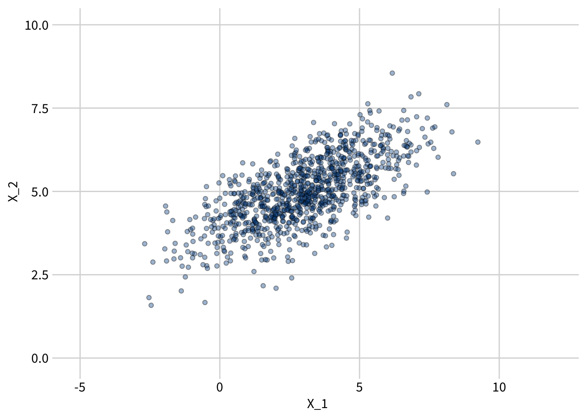

# Basic Probability and Statistics


```r
library(tidyverse)
library(extrafont)

library(MASS)
```

Here is some code to generate and plot 1000 samples from a bivariate normal distribution.

```r
# Set parameters
set.seed(7)

mean1 <- 3
mean2 <- 5

sd1 <- 2
sd2 <- 1
rho <- 0.7

# Compute the covariance from the variances and the correlation
cov <- rho * sd1 * sd2

# Generate 1000 draws
m <- mvrnorm(n = 1000, mu = c(mean1, mean2), Sigma = matrix(c(sd1^2, cov, cov, sd2^2), nrow=2))

# Set column names and convert to tibble
colnames(m) <- c("x1", "x2")
df <- as_tibble(m)
```

```r
df %>%
  ggplot(aes(x=x1, y=x2)) +
  geom_point(alpha=0.4, fill="#005394", shape=21) +
  scale_x_continuous(limits=c(-5,12)) +
  scale_y_continuous(limits=c(0,10)) +
  cowplot::theme_minimal_grid() +
  labs(x = "X_1",
       y = "X_2") +
  theme(text = element_text(size = 12, family = "Source Sans Pro"))
```

<div class="figure">

<p class="caption">(\#fig:unnamed-chunk-4)1,000 samples from a bivariate normal distribution with mean vector (3,5), standard deviation vector (2,1), and rho = 0.7.</p>
</div>


```r
# Test the equation for sd(X1+X2)

sd(m[,1] + m[,2])
```

```
## [1] 2.755895
```

```r
sqrt(sd1^2 + sd2^2 + 2*cov)
```

```
## [1] 2.792848
```

