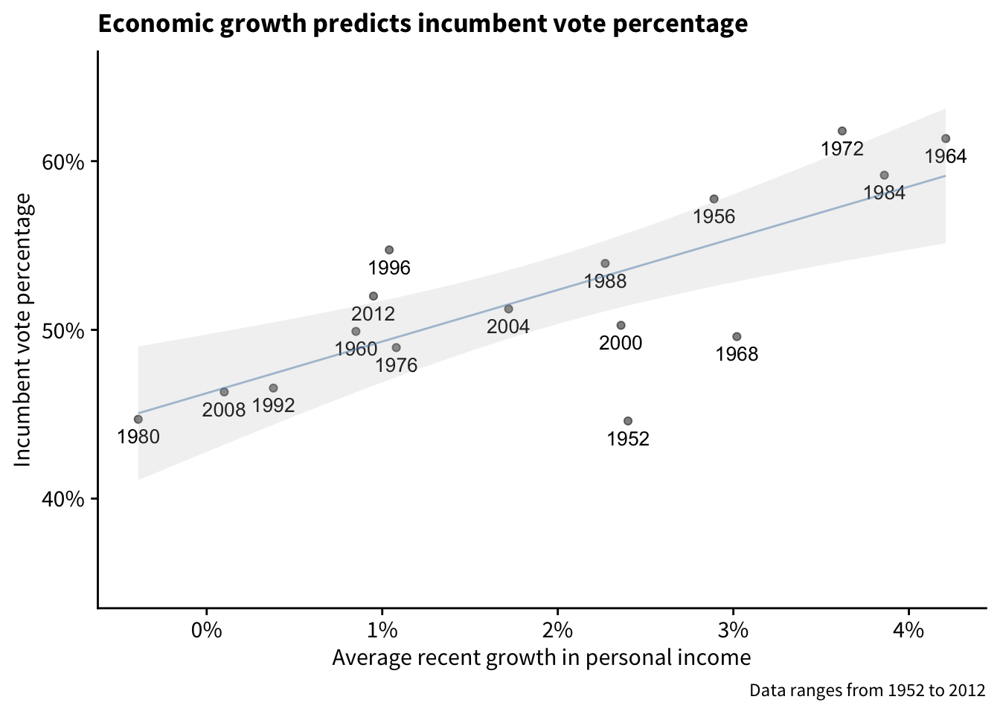

# Overview


```r
library(tidyverse)
```


```r
# Figure 1.1

df <- read.csv("~/ROS_notes/ROS-Examples-master/ElectionsEconomy/data/hibbs.dat", sep = "")

# Convert from percentage to decimal
df$growth <- df$growth / 100

df %>%
  ggplot(aes(x = growth, y = vote, label = year)) +
  geom_point(alpha = 0.5) +
  geom_text(nudge_y = -1) +
  geom_smooth(method = "lm") +
  scale_x_continuous(labels = scales::percent_format(accuracy = 1)) +
  cowplot::theme_cowplot() +
  labs(
    x = "Average recent growth in personal income",
    y = "Incumbent vote percentage"
  )
```



